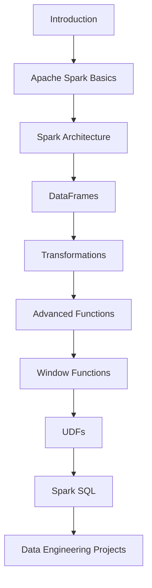

# ⚡ Learning PySpark — Complete Roadmap

<div align="center">


<h3>🚀 Master PySpark from Beginner to Advanced Level</h3>

<p>
A complete hands-on learning repository for Apache Spark & PySpark with Databricks.
</p>

---

</div>

# 🌑 About This Repository

This repository contains complete notes, concepts, practical examples, and learning resources for mastering **PySpark** and **Apache Spark**.

The course covers:

* Apache Spark Fundamentals
* Spark Architecture
* DAG & Lazy Evaluation
* DataFrames & Transformations
* Window Functions
* UDFs
* Spark SQL
* Databricks
* Parquet
* Managed vs External Tables
* Advanced PySpark Functions

---

# 📚 Course Topics Covered

## 🟢 Beginner Level

| #  | Topic                           | Duration |
| -- | ------------------------------- | -------- |
| 1  | Introduction                    | `0:00`   |
| 2  | What is Apache Spark?           | `3:47`   |
| 3  | Apache Spark Architecture       | `5:33`   |
| 4  | Lazy Evaluation in Apache Spark | `10:47`  |
| 5  | Spark Jobs, Stages, and Tasks   | `12:51`  |
| 6  | Databricks Free Account Setup   | `14:46`  |
| 7  | Databricks Overview             | `16:28`  |
| 8  | Data Ingestion                  | `20:03`  |
| 9  | Databricks Notebook Overview    | `21:46`  |
| 10 | Spark Cluster                   | `22:46`  |
| 11 | Data Reading with PySpark       | `23:36`  |
| 12 | Spark Data Reader API           | `27:46`  |
| 13 | Spark DAG                       | `34:00`  |
| 14 | StructType and DDL Schema       | `43:00`  |

---

## 🟡 Intermediate Level

| #  | Topic                                            | Duration  |
| -- | ------------------------------------------------ | --------- |
| 15 | Data Transformation with PySpark (For Beginners) | `56:00`   |
| 16 | PySpark Intermediate Level Transformations       | `1:53:37` |

---

## 🔴 Advanced Level

| #  | Topic                                    | Duration  |
| -- | ---------------------------------------- | --------- |
| 17 | PySpark Advanced Level Functions         | `3:21:51` |
| 18 | Window Functions in PySpark              | `4:22:09` |
| 19 | User Defined Functions (UDFs) in PySpark | `4:52:20` |
| 20 | Data Writing with PySpark                | `5:02:10` |
| 21 | Data Writing Modes in PySpark            | `5:09:59` |
| 22 | Parquet File Format                      | `5:23:33` |
| 23 | Managed vs External Tables in Spark      | `5:35:34` |
| 24 | SparkSQL                                 | `5:46:49` |

---

# 🧠 Key Concepts You Will Learn

```bash
✔ Distributed Computing
✔ Cluster Computing
✔ Spark Execution Engine
✔ DAG Optimization
✔ Lazy Evaluation
✔ DataFrame API
✔ Spark SQL
✔ Window Functions
✔ UDF Optimization
✔ Data Engineering Concepts
✔ Big Data Processing
✔ Parquet Optimization
✔ Databricks Workflows
```

---

# ⚙️ Technologies Used

<div align="center">

| Technology   | Purpose                     |
| ------------ | --------------------------- |
| Apache Spark | Distributed Data Processing |
| PySpark      | Python API for Spark        |
| Databricks   | Cloud Analytics Platform    |
| Python       | Programming Language        |
| Spark SQL    | Query Engine                |
| Parquet      | Columnar File Format        |

</div>

---

# 🏗 Apache Spark Architecture

```text
                +-------------------+
                |   Driver Program  |
                +-------------------+
                          |
         ------------------------------------
         |                |                |
+----------------+ +----------------+ +----------------+
| Executor Node  | | Executor Node  | | Executor Node  |
+----------------+ +----------------+ +----------------+
| Task Execution | | Task Execution | | Task Execution |
+----------------+ +----------------+ +----------------+
```

---

# 🔥 PySpark Learning Path



---

# 📂 Recommended Repository Structure

```bash
Learning-PySpark/
│
├── datasets/
├── notebooks/
├── scripts/
├── spark_sql/
├── parquet/
├── udf_examples/
├── window_functions/
├── transformations/
├── architecture_notes/
└── README.md
```

---

# 🚀 Setup Instructions

## 1️⃣ Install PySpark

```bash
pip install pyspark
```

## 2️⃣ Verify Installation

```python
import pyspark
print("PySpark Installed Successfully")
```

## 3️⃣ Start Spark Session

```python
from pyspark.sql import SparkSession

spark = SparkSession.builder \
    .appName("LearningPySpark") \
    .getOrCreate()

print("Spark Session Created")
```

---

# 💡 Important Topics to Practice

## 🔹 DataFrame Operations

```python
df.show()
df.select()
df.filter()
df.groupBy()
df.join()
```

## 🔹 Window Functions

```python
from pyspark.sql.window import Window
from pyspark.sql.functions import row_number
```

## 🔹 Spark SQL

```python
df.createOrReplaceTempView("employees")

spark.sql("""
SELECT * FROM employees
""")
```

---

# 📈 Why Learn PySpark?

✅ High demand in Data Engineering
✅ Used by top tech companies
✅ Handles massive datasets
✅ Faster than traditional processing systems
✅ Essential for Big Data careers

---

# 🎯 Career Roles After Learning PySpark

| Role               | Level |
| ------------------ | ----- |
| Data Engineer      | ⭐⭐⭐⭐⭐ |
| Big Data Engineer  | ⭐⭐⭐⭐⭐ |
| Spark Developer    | ⭐⭐⭐⭐  |
| ETL Developer      | ⭐⭐⭐⭐  |
| Analytics Engineer | ⭐⭐⭐⭐  |

---

# 🖤 Black Theme Developer Style

```python
theme = {
    "background": "#0D1117",
    "text": "#C9D1D9",
    "accent": "#FF6B35",
    "spark": "#E25A1C"
}
```

---

# 📖 Best Practices

* Use DataFrames instead of RDDs
* Avoid unnecessary shuffles
* Prefer built-in Spark functions over UDFs
* Use Parquet format for optimized performance
* Cache data only when required
* Partition data wisely

---

# 🏁 Final Goal

> Become industry-ready in PySpark and Apache Spark by mastering:
>
> * Distributed Computing
> * Data Engineering
> * ETL Pipelines
> * Big Data Processing
> * Spark Optimization
> * Cloud Data Platforms

---

<div align="center">

# ⭐ Happy Learning PySpark ⭐

### 🚀 Keep Building • Keep Scaling • Keep Learning

</div>
